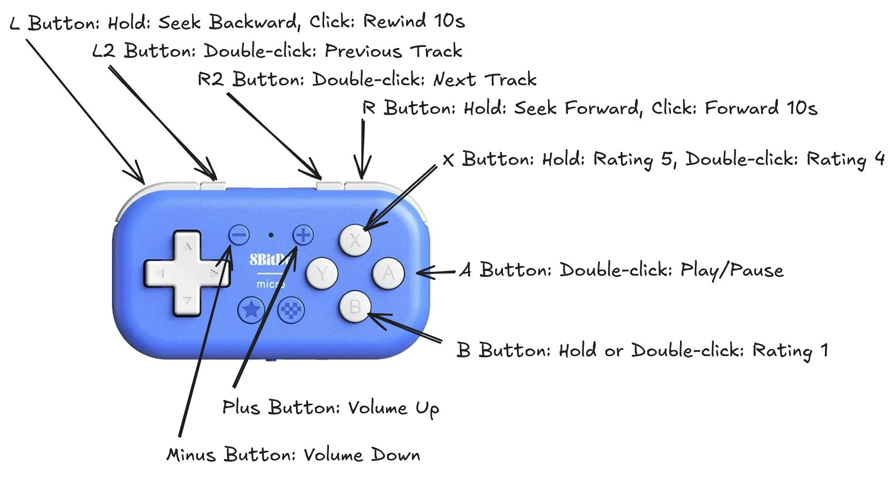

# Blind Crate Digging

## Description

Toolkit for blind crate digging: rate tracks in [**Poweramp**](https://play.google.com/store/apps/details?id=com.maxmpz.audioplayer&hl=en) with a **gamepad** during walks and sync ratings to **Engine DJ**.  
This repo includes:
- ✅ [Key Mapper](https://play.google.com/store/apps/details?id=io.github.sds100.keymapper&hl=en) config file  
- ✅ Python sync script  
- ✅ Gamepad button map image with function labels

## How It Works

1. **Rate Tracks On The Go**  
   Use a small gamepad (e.g., 8BitDo Micro) with [Key Mapper](https://play.google.com/store/apps/details?id=io.github.sds100.keymapper&hl=en) to send [Poweramp](https://play.google.com/store/apps/details?id=com.maxmpz.audioplayer&hl=en) commands. Example bindings:

   L Button: Hold → Seek Backward, Click → Rewind 10s  
   R Button: Hold → Seek Forward, Click → Forward 10s  
   L2 Button: Double-click → Previous Track  
   R2 Button: Double-click → Next Track  
   Plus Button: Volume Up  
   Minus Button: Volume Down  
   X Button: Hold → 5 Stars, Double-click → 4 Stars  
   B Button: Hold or Double-click → 1 Star  
   A Button: Double-click → Play/Pause

2. **Export Playlist**  
   Export liked tracks with ratings using **New Playlist Manager** (`.m3u` format).

3. **Sync to Engine DJ**  
   Run the Python script to read the `.m3u`, match tracks in your Engine DJ database, and update the ratings.

## Files

- `key_maps.zip` — ready-to-import Key Mapper config
- `update_enginedj.py` — Python script for updating Engine DJ DB
- `gamepad_map.png` — visual button map with the same function labels

## License

MIT — see [LICENSE](LICENSE).

## Questions?

Open an issue or start a discussion!
